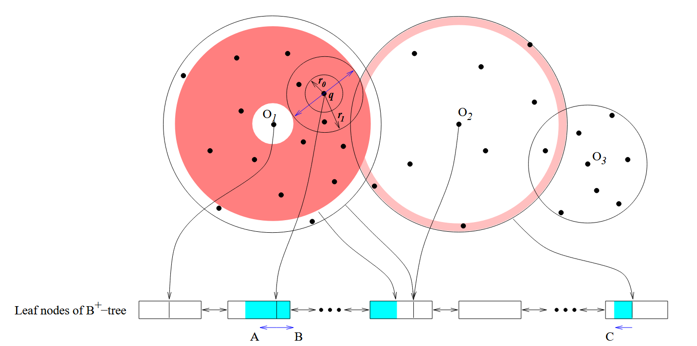

# iDistance: An Adaptive B+ tree Based Indexing Method for Nearest Neighbor Search

## Paper Framework

## Motivation

> Generally, most of these structures are not adaptive to data distributions. Consequently, they tend to perform well for some datasets and poorly for others.
> 
大部分的索引结构不能很好的考虑数据分布，往往只能在某一些数据集上表现好

## Contribution

> we present iDistance, a new technique for KNN search that can be adapted to different data distributions.

作者提出了 iDistance，这是一种 KNN 搜索新技术，可以适应不同的数据分布。

## Method

**核心思路**：通过划分区域，对每个区域选择参考点，根据区域内的点到参考点的距离把特征转换成**一维值**，再进行B+树索引构建

- 可以参考选定的参考点或代表点导出数据点之间的（不）相似性
- 可以根据数据点到参考点的距离对数据点进行排序。
- 距离本质上是一个单维值

核心剪枝思路：**三角不等式**
$$
dist(p_1, p_3) ≤ dist(p_1, p_2) + dist(p_2, p_3) ∀p_1, p_2, p_3 ∈ DataBase
$$下面进行详细的分析。

用到的符号：

- $O_i$：区域的代表点
- $P_i$：区域
- $p$：数据点
- $q$：查询点
- $dist\_max_i$：区域的半径（区域$P_i$内的$p$到$O_i$的最大距离）

根据三角形两边之和大于第三边，两边差小于第三边，我们可以得到这样一个不等式：$$
dist(O_i, q) − dist(p, q) ≤ dist(O_i, p) ≤ dist(O_i, q) + dist(p, q)
$$那么我们可以通过$$
 dist(O_i, q) − querydist(q) ≤ dist\_max_i,
$$判断区域是否需要加载到内存进行搜索。因为如果区域最大距离$dist\_max_i$都无法满足三角不等式，那么区域当中的点一定不会落在查询的范围内。筛选完区域之后，我们可以进一步筛选指定距离范围$$
[dist(O_i, q)-querydist(q), min(dist maxi, dist(O_i, q)+ querydist(q))]
$$内的点，对于图中的查询，只需要加载红色区域的点即可。

接下来将进一步细化具体实现。

### 数据结构 & KNN Search

#### 距离特征

首先，需要根据数据点到参考点的距离生成一个一维的特征值方便B+树发挥效能。$$
p : (x_0, x_1, . . . , x_{d−1}), 0 ≤ x_j ≤ 1, 0 ≤ j < d
$$$$
y = i × c + dist(p, O_i), c \in R
$$

### 参考点选择
